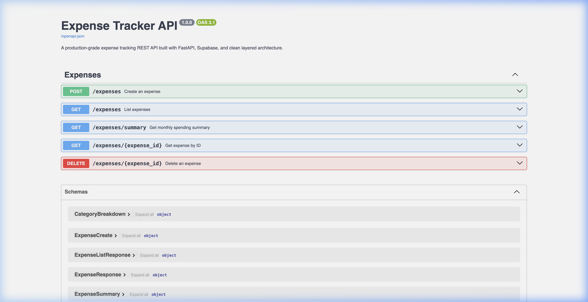
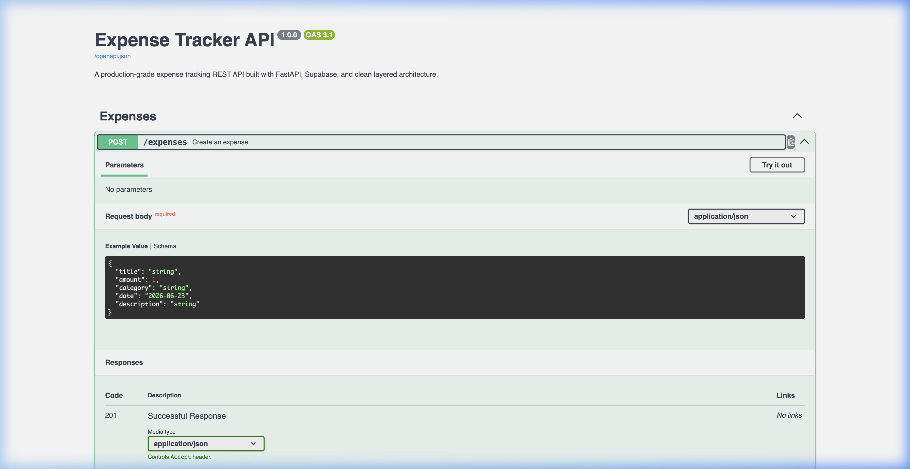
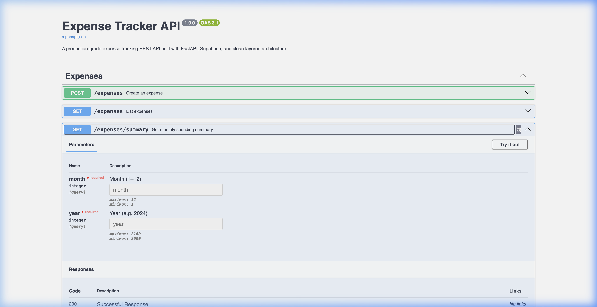

# Expense Tracker API - Screenshots

### 1. Interactive Swagger UI API Documentation
This screenshot shows the automatically generated interactive API documentation playground provided by FastAPI. It lists all five implemented endpoints: `POST`, `GET`, `GET by ID`, `DELETE`, and `GET summary`.

### 2. Creating an Expense (POST /expenses)
This shows the expanded `POST /expenses` endpoint, demonstrating how a user can create a new expense by inputting the title, amount, category, date, and optional description. It responds with the saved expense details along with its unique ID.

### 3. Monthly Spend Summary (GET /expenses/summary)
This shows the `GET /expenses/summary` endpoint execution, which takes a target month and year and calculates the total spending for that month, accompanied by a clean category-wise cost breakdown.

